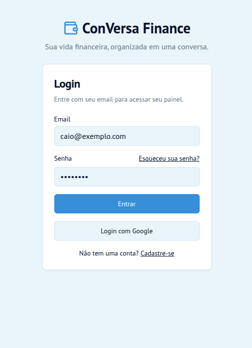

# ConVersa Finance: App de Organização de Finanças Pessoais com Vibe Coding

Solução para o desafio DIO/Caixa "Criando um APP de Organização de Finanças Pessoais com Vibe Coding".

Foram usados neste trabalho, as ferramentas de AI: 
- DeepSeek (para refinamento do PRD)
- Firebase Studio (para Vibe Coding)

## Entrega

### Prompt final (PRD)

#### PRD - Aplicativo de Organização Financeira por Conversa (MVP)

##### 1. Visão do Produto
**Nome do Produto:** Finanças ConVersa  
**Missão:** Democratizar o controle financeiro pessoal através de uma interface conversacional intuitiva, eliminando a complexidade de planilhas e formulários manuais.

##### 2. Problema & Oportunidade
###### Problema Principal
Usuários iniciantes abandonam apps de finanças porque:
1. **Fricção na entrada:** Preencher formulários é tedioso e disruptivo
2. **Complexidade excessiva:** Categorias rígidas não refletem sua realidade
3. **Falta de contexto:** Apps tradicionais não oferecem orientação personalizada

###### Oportunidade
Criar uma experiência fluida onde o usuário **conversa** naturalmente sobre seus gastos, recebendo em troca organização automática e insights acionáveis.

##### 3. Público-Alvo (Personas)

###### Persona Primária: **"Caio, 28 anos"**
- Profissional júnior, renda de R$ 3.500/mês
- Tem conhecimento básico de finanças
- Usa 3-5 apps financeiros, mas não mantém consistência
- **Frustrações:** "Sempre esqueço de registrar", "Não sei categorizar direito"
- **Objetivo:** Controlar gastos semanalmente e economizar para uma viagem

###### Persona Secundária: **"Mariana, 35 anos"**
- Freelancer, renda variável
- Precisa separar gastos pessoais e profissionais
- **Frustrações:** "Planilhas dão muito trabalho", "Não tenho tempo"
- **Objetivo:** Simplificar o controle e prever fluxo de caixa

##### 4. Funcionalidades do MVP (Priorizadas)

###### Sprint 1: Núcleo Conversacional
**US01: Registrar Transações via Chat**
**Critérios de Aceitação:**
- DADO que o usuário envia "Comprei café por R$ 15 agora"
- QUANDO o NLP processa a mensagem
- ENTÃO extrai: valor (R$15), categoria (alimentação), data (hoje/hora atual)
- E apresenta: "Confirmo: R$15 em Alimentação (café). Salvar?"

**US02: Confirmação e Correção**
**Critérios de Aceitação:**
- DADO que o sistema mostra uma transação para confirmação
- QUANDO o usuário responde "não, foi R$ 12"
- ENTÃO atualiza o valor e pede nova confirmação

###### Sprint 2: Organização e Visualização
**US03: Categorização Automática**
**Critérios de Aceitação:**
- DADO que o usuário registra "paguei conta de luz de R$ 200"
- QUANDO o sistema processa
- ENTÃO categoriza como "Utilidades" com 95% de confiança
- E permite recategorização manual se necessário

**US04: Resumo Financeiro Simples**
**Critérios de Aceitação:**
- DADO que o usuário pede "como estou esse mês?"
- QUANDO o sistema responde
- ENTÃO mostra: Total gasto, principais categorias, comparação com mês anterior
- E oferece opção de detalhar por categoria

###### Sprint 3: Orientação e Metas
**US05: Meta Financeira Simples**
**Critérios de Aceitação:**
- DADO que o usuário diz "quero economizar R$ 500 este mês"
- QUANDO o sistema configura a meta
- ENTÃO calcula economia diária sugerida (R$ 16,13/dia)
- E notifica progresso semanal

**US06: Dica Semanal Personalizada**
**Critérios de Aceitação:**
- DADO que é segunda-feira 9h
- QUANDO o usuário abre o app
- ENTÃO recebe: "Sua maior categoria foi Restaurante (R$ 300). Que tal reduzir 20% esta semana?"

##### 5. Requisitos Não-Funcionais

###### Performance
- Tempo de resposta do chat: < 2 segundos (p95)
- Processamento NLP: < 1 segundo
- Offline: Funcionalidade básica de visualização disponível

###### Segurança & Privacidade
- Todos os dados em trânsito e repouso criptografados
- Autenticação via Firebase Auth
- Conformidade com LGPD: dados pessoais anonimizáveis
- Backup automático diário

###### Usabilidade
- Acessibilidade: Suporte a leitores de tela
- Idioma: Português do Brasil (com variações regionais)
- Suporte a emojis e expressões informais

##### 6. Estrutura de Dados (Firebase)

###### Coleção: `users`
```javascript
{
  userId: "string_único",
  name: "string",
  monthlyGoal: number,
  currency: "BRL",
  createdAt: timestamp,
  notificationTime: "09:00"
}
```

###### Coleção: `transactions`
```javascript
{
  transactionId: "string_único",
  userId: "referência",
  amount: number,
  category: "alimentação|transporte|lazer|...",
  subcategory: "café|combustível|cinema|...",
  date: timestamp,
  originalMessage: "string",
  confirmed: boolean,
  createdAt: timestamp,
  nlpConfidence: number // 0-1
}
```

###### Coleção: `nlp_training`
```javascript
{
  phrase: "gastei 50 reais no almoço",
  entities: {
    amount: 50,
    category: "alimentação",
    dateContext: "hoje"
  },
  userId: "opcional",
  corrected: boolean // se o usuário corrigiu
}
```
--- 

- Prints ou pequenos vídeos das interações com a IA;  



## Resumo do que o **App de Finanças Pessoais** faz; 

Finanças ConVersa é um aplicativo de organização financeira pessoal que simplifica o controle de gastos através de uma interface de chat. Em vez de preencher formulários, o usuário simplesmente conversa com o aplicativo, descrevendo suas despesas em linguagem natural (ex: "Comprei um café por R$ 15"). A inteligência artificial do app extrai, categoriza e salva a transação automaticamente. Além do registro de gastos, a aplicação oferece um painel com resumos visuais, gastos por categoria e dicas semanais personalizadas para ajudar o usuário a atingir suas metas de economia.

- Uma breve **reflexão sobre o processo**:
  - O que funcionou bem?  
  - O que não funcionou como o esperado?  
  - O que aprendeu sobre conversar com IAs?


## 💬 Conclusão

Vibe Coding é sobre clareza, curiosidade e criatividade, não sobre perfeição técnica. O verdadeiro objetivo aqui é aprender a pensar junto com a IA, transformando ideias em conceitos reais e enxergando a tecnologia como uma extensão do seu raciocínio criativo. Cada interação é um experimento, quanto mais clara for sua intenção, mais surpreendente será o resultado.
